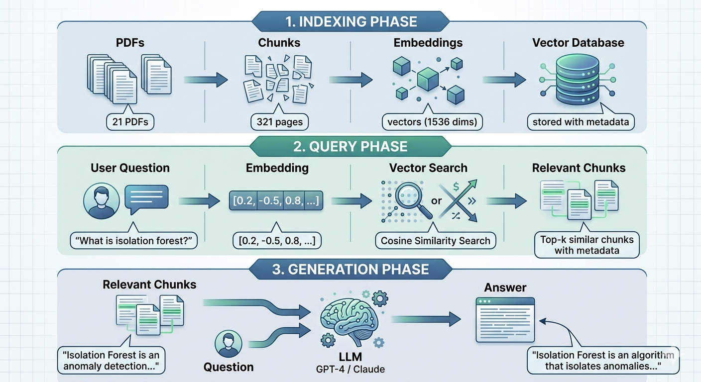
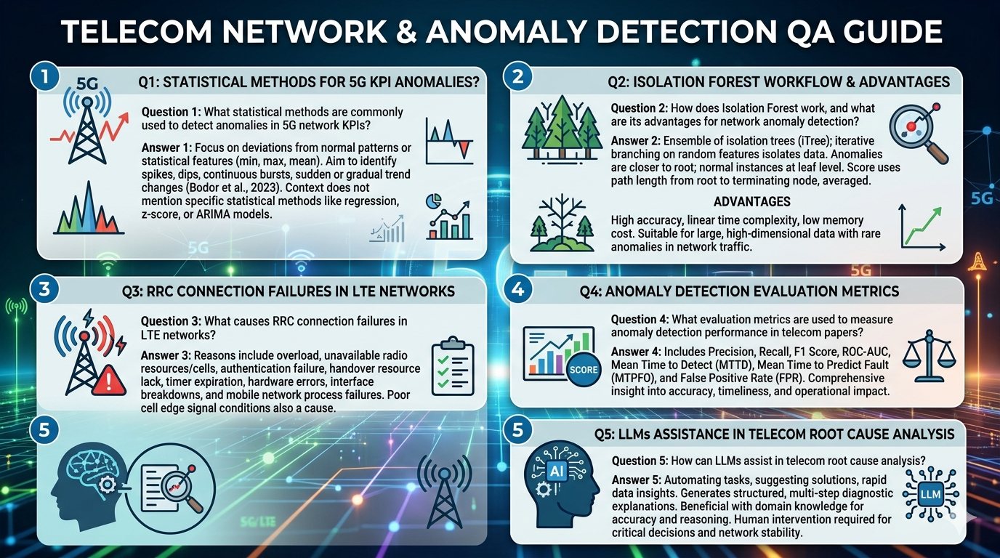

# 📡 Telecom RAG Chat System

### Retrieval-Augmented Generation for Telecom Research Papers

---
## RAG system FLow Chart



---
## 🚀 Project Overview

This repository implements a **telecom-focused RAG chat system** that answers questions from a corpus of research papers using a vector search pipeline and a local LLM.

The latest version includes:

* A **Gradio-based chat UI** in `app.py`
* **Database management buttons** for clearing and populating the vector store
* **Reranking** of retrieval candidates using `BAAI/bge-reranker-base`
* **Output logging** of retrieved chunks into `output.txt`
* Improved pipeline transparency for sources and retrieval metadata

---

## 📌 First release: what to know

This is the first release of the Telecom RAG Chat System. The current implementation includes:

* `app.py` — a **Gradio chat interface** with:
  * query input box
  * generated answer output
  * retrieved source context output
  * buttons to **clear** and **populate** the ChromaDB
* `src/ingestion/populate_database.py` — builds and persists the Chroma vector database
* `src/ingestion/loader.py` — loads PDF pages from `data/`
* `src/ingestion/chunking.py` — splits documents into embedding-friendly chunks
* `src/embeddings/get_embedding.py` — embeddings with **BAAI/bge-m3**
* `src/retrieval/query_data.py` — performs similarity search and reranking
* `src/retrieval/reranker.py` — reranks results using `BAAI/bge-reranker-base`
* `src/retrieval/prompt.py` — constructs prompts and invokes **Mistral** via Ollama
* `output.txt` — logs retrieved chunk previews and scores for each query

This release also includes a two-stage retrieval flow: similarity search in ChromaDB followed by reranking with a CrossEncoder.

---

## 📂 Project Structure

```
Analytics_Project/
├── app.py
├── papers_catalog.csv
├── output.txt
├── chroma_db/                # persistent Chroma vector store
├── data/                     # PDF source documents
├── src/
│   ├── embeddings/
│   │   └── get_embedding.py
│   ├── ingestion/
│   │   ├── loader.py
│   │   ├── chunking.py
│   │   └── populate_database.py
│   └── retrieval/
│       ├── prompt.py
│       ├── query_data.py
│       └── reranker.py
└── README.md
```

---

## 📚 Dataset

* Source: **arXiv telecom papers**
* Stored as PDFs under `data/`
* Metadata is tracked in `papers_catalog.csv`

---

## ⚙️ Installation

### 1️⃣ Clone the repository

```bash
git clone <your-repo-link>
cd Analytics_Project
```

### 2️⃣ Install dependencies

```bash
pip install -r requirements.txt
```

### 3️⃣ Install Ollama models

```bash
ollama pull mistral
```

> If you are using an Ollama environment, ensure Ollama is installed and running.

---

## 🏗️ How the system works

1. `src/ingestion/loader.py` loads PDF pages from `data/`
2. `src/ingestion/chunking.py` splits pages into chunks
3. `src/embeddings/get_embedding.py` embeds chunks with **BAAI/bge-m3**
4. `src/ingestion/populate_database.py` persists vectors into `chroma_db/`
5. `src/retrieval/query_data.py` retrieves similar chunks and reranks them
6. `src/retrieval/prompt.py` sends the assembled context to **Mistral** via Ollama

---

## 💻 Usage

### Populate the database

You can populate the vector database from the command line:

```bash
python src/ingestion/populate_database.py
```

Or use the Gradio UI button:

1. Start the app
2. Click **📥 Populate DB**

### Launch the app

```bash
python app.py
```

Then open the local Gradio URL shown in the terminal.

### Ask a question

* Enter your telecom question in the query box
* Click **🔍 Ask**
* Review the generated answer
* Review the source chunks shown below

---

## 🧩 What the app provides

* **Answer output** generated by Mistral using retrieved context
* **Retrieved context source list** from top reranked chunks
* **Database controls** to clear and rebuild the vector store
* **Automatic query logging** in `output.txt`

---

## 📝 Notes on implementation

* RAG uses **Top-5** reranked chunks for answer generation
* Prompt enforces grounded answers:

```text
Answer ONLY using the context below.
If the answer is not explicitly in the context, say "I don't know".
```
* `output.txt` stores retrieved chunk previews and scores for each query

---

## 🧪 Chunk size evaluation

| Chunk size | Chunk overlap | Expected behavior | What to observe |
|-----------:|--------------:|------------------|-----------------|
| 400        | 80            | Very small chunks with limited context | Chunks may be too short to carry full answers; retrieval can become noisy and incomplete |
| 1200       | 200           | Balanced chunk length with semantic coherence | Best baseline: enough context for meaning while remaining focused for precision |
| 2000       | 300           | Large chunks with broad context | Larger context may include more answer text, but precision can drop as chunks contain unrelated material |

In practice, the baseline setting (`1200`, `200`) is usually the best choice because it preserves enough meaning for retrieval while keeping chunks focused enough for accurate ranking. Smaller chunks often lose coherence, and larger chunks can hurt precision by pulling in excess irrelevant content.

---

## 🚀 Recommended workflow

1. Install dependencies
2. Pull Ollama models
3. Populate the database once
4. Run `python app.py`
5. Ask telecom questions and inspect source chunks

---

## ✅ Example queries and answers



---
